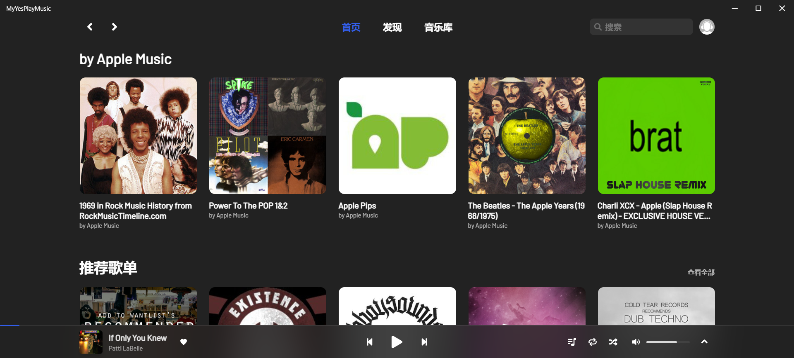
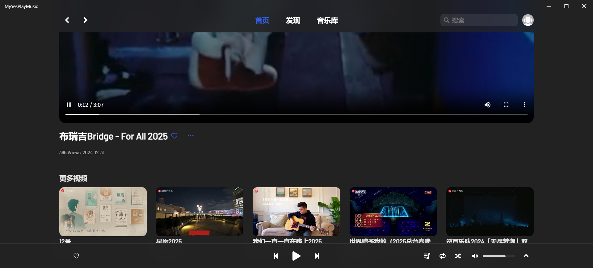
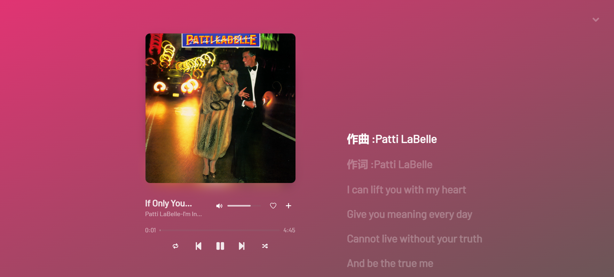
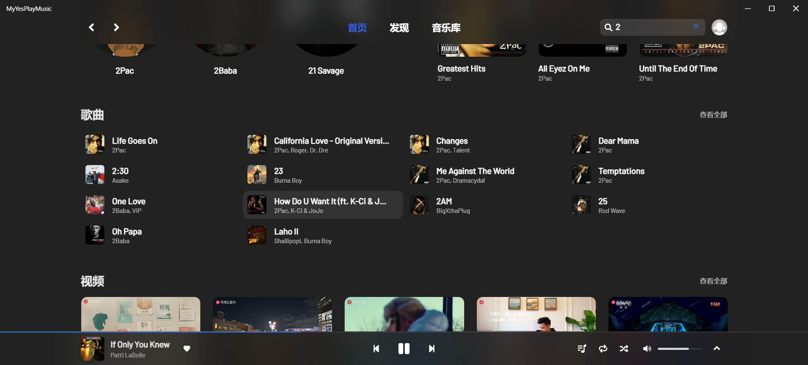
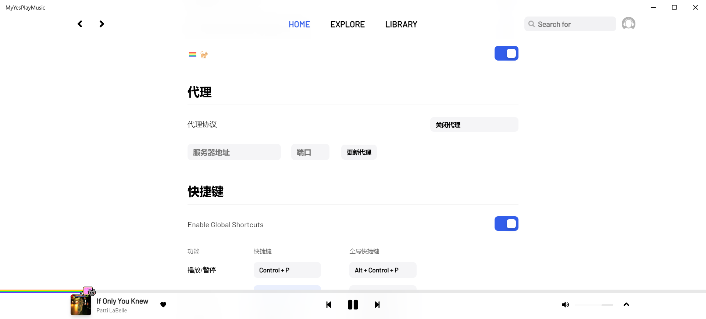
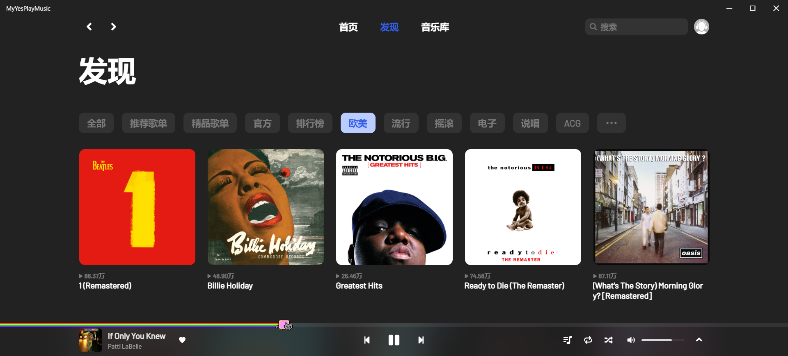
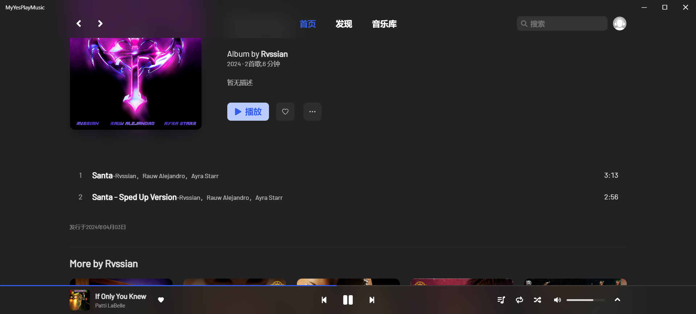

<br />
<p align="center">
  <a href="https://musicplayernodejs-production.up.railway.app/login" target="blank">
    
  </a>
  <h2 align="center" style="font-weight: 600">MusicPlayer</h2>

  <p align="center">
    一个普通的第三方spotify播放器
    <br />
    <a href="https://musicplayernodejs-production.up.railway.app/login" target="blank"><strong>访问音乐播放器</strong></a>&nbsp;&nbsp;|&nbsp;&nbsp;
    <a href="#%EF%B8%8F-安装" target="blank"><strong>使用指南</strong></a>&nbsp;&nbsp;|&nbsp;&nbsp;
    <a href="https://t.me/yesplaymusic" target="blank"><strong>API介绍</strong></a>
    <br />
    <br />
  </p>
</p>



## ✨ 项目介绍

这是一个基于React + TypeScript + Vite，涉及jotai 原子化状态管理、@tanstack/react-query等技术栈,面向spotify用户的现代化音乐播放器应用，以下是该播放器所具备的几个主要特性：
- 🔴 spotify账号登陆
- 📺 支持 MV 播放
- 📃 支持歌词显示
- 📻 每日推荐歌曲
- 🎵 支持播放、暂停、上一首、下一首等基本操作
- 📱 支持收藏喜欢的歌曲
- 🌙 支持浅色/深色主题切换
- 🔍 快速查找歌曲、艺术家和专辑
- 🛠️ 个性化播放体验

## 📦️ 使用手册

目前该项目仅适配Windows系统。

项目本地下载：
```sh
//克隆指令
git clone https://github.com/JayFilker/music-player.git
//进入项目
cd ./music-player
//安装依赖
npm install
//运行项目
npm run dev
```
后端下载：
该项目除了项目本体之外，若想在本地运行，需要另外下载配套的后端服务器代码以提供后端服务
```sh
//克隆指令
git clone https://github.com/JayFilker/music_player_nodejs.git
//进入后端文件夹
cd ./music_player_nodejs
//下载依赖
npm install
//运行后端服务器
npm start
```

```html
//接下来还不能直接使用，由于需要本地化运行，原本指向挂载网站的地址需要改成指向本地服务器的地址，将以下代码分别注释和解除注释：
//代码路径：music-player/src/components/Bottom/index.tsx
//注释
const response = await fetch(`https://musicplayernodejs-production.up.railway.app/refresh_token?refresh_token=${encodeURIComponent(refreshToken)}`, { 
   method: 'GET',
   headers: {
       'Content-Type': 'application/json',
   },
)
//解除注释
const response = await fetch(`http://localhost:3000/refresh_token?refresh_token=${encodeURIComponent(refreshToken)}`, {
method: 'GET',
headers: {
'Content-Type': 'application/json',
},
})
//代码路径：music-player/src/pages/CallbackPage/index.tsx
//注释
const response = await axios.post('https://musicplayernodejs-production.up.railway.app/api/exchange-token', { code })
//解除注释
const response = await axios.post('http://localhost:3000/api/exchange-token', { code })
```
接下来便能成功运行项目了，使用http://localhost:3000/login在浏览器中打开并完成spotify登陆，即可使用该音乐播放器。

注：如果你想把该项目挂载到网站上运行，就需要把上面提到要注释的内容解除注释，解除注释的内容重新注释，然后将地址改为你挂载的地址。这里推荐使用vercel挂载前端，railway挂载后端，本项目线上访问音乐播放器所采取的挂载方案就是vercel+railway

## ⚙️ API详情
本项目整合了多个数据源和服务，为音乐播放器提供全面的功能支持：

1. 音乐数据和播放功能通过 Spotify Web API 实现
2.  MV 视频存储在七牛云，通过自建后端 API 获取
3. 歌词数据通过 Happi.dev API 获取
4. 用户收藏数据存储在 MongoDB Atlas，与 MV 视频一样，都是通过自建后端 API 进行管理

## 📜 开源许可

本项目仅供个人学习研究使用，禁止用于商业及非法用途。

## 🖼️ 项目截图展示

- 
- 
- 
- 
- 
- 
- 
